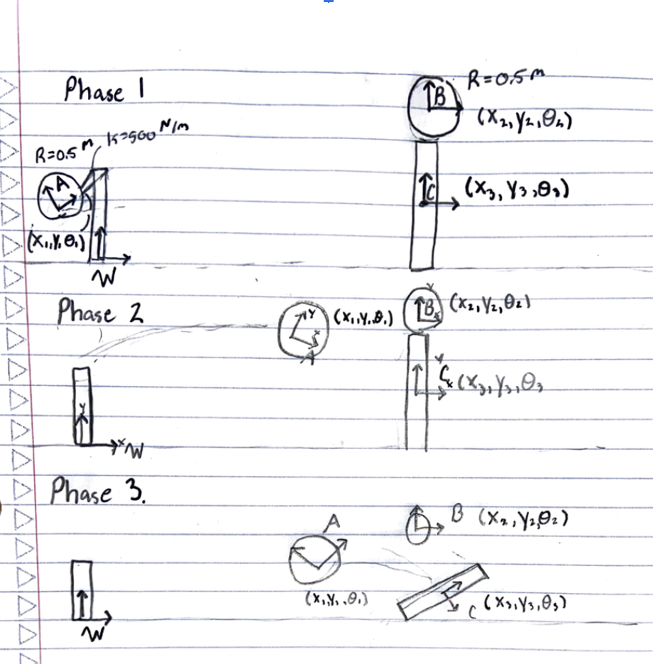
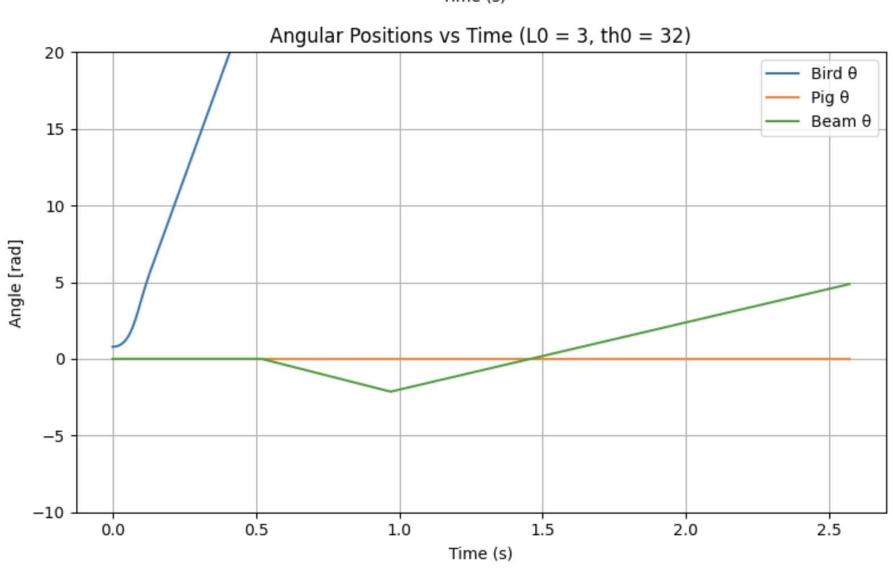
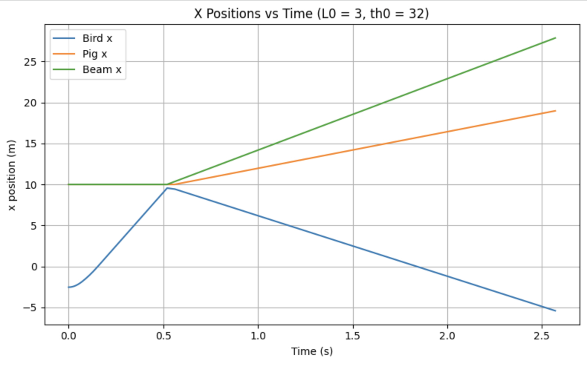
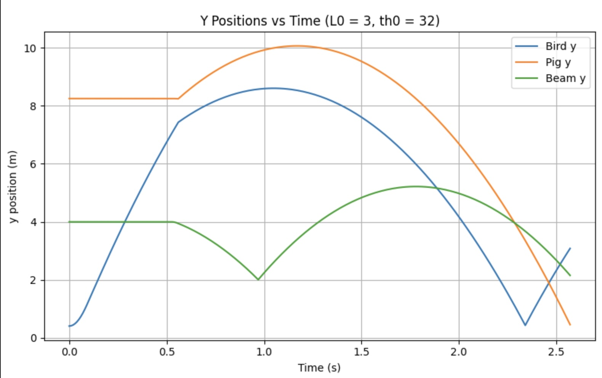
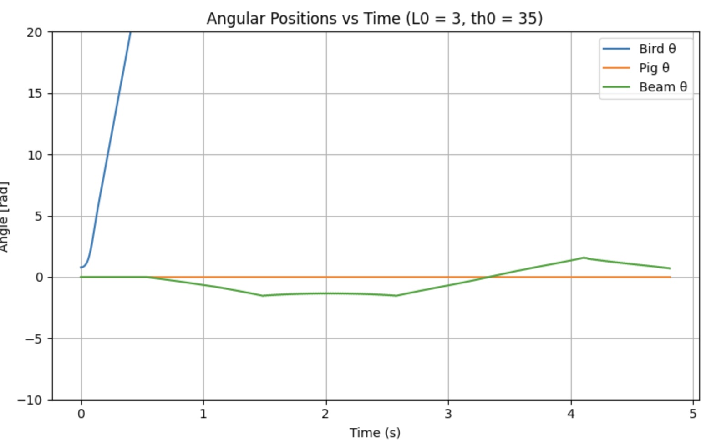
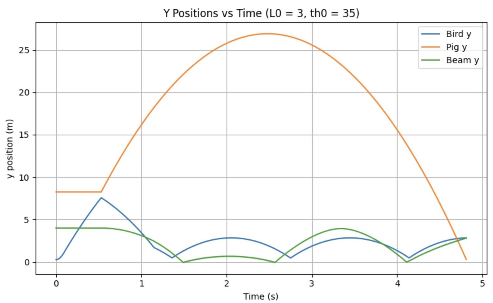

# Simulating Angry Birds
My final project for ME-314 Theory of Machines - Dynamics at Northwestern University
## Table of Contents
- [Project Overview](#project-overview)
- [Simulating the System's Dynamics](#dynamics-simulation)
- [Demo](#demo)
## Project Overview

This course studied rigid multibody mechanics, including Lagrangian mechanics, impact dynamics, and variational principles. For my final project, I decided to simulate a system based on the popular mobile game Angry Birds. The system consisted of three rigid bodies: two spheres of equal dimensions, which are the bird and pig, and a rectangular beam on which they sit. This simulation included the dynamics of the multi-body system over time, along with all possible interactions between the three rigid bodies.

All rigid bodies are in gravity, and there are no external, non-conservative forces. The direction of the gravitational force corresponds to the vertical negative y direction. The only other external force is an elastic force from an ideal spring used to accelerate and launch the bird. 

This system has a total of nine degrees of freedom, three for each rigid body. Since this simulation is planar, each rigid body has configuration variables corresponding to its horizontal and vertical positions, namely the x and y coordinates. These coordinates are the position of the centers of mass of each rigid body. In addition, the angle of each rigid body relative to the horizontal x-axis is treated as a configuration variable. While the system exists in three-dimensional space, its z-coordinate is fixed.

The vector of configuration variables as used in the equations and code can be seen below:

$$
\mathbf{q} =
\begin{bmatrix}
x_{\text{bird}} \\
y_{\text{bird}} \\
\theta_{\text{bird}} \\
x_{\text{pig}} \\
y_{\text{pig}} \\
\theta_{\text{pig}} \\
x_{\text{beam}} \\
y_{\text{beam}} \\
\theta_{\text{beam}}
\end{bmatrix}
$$

All rigid bodies initially start at rest. The bird is located at the end of an ideal spring that acts as my simulation’s slingshot. The other end of the spring is fixed at a height of 2m with coordinates (0, 2, 0) in the world frame. The bird and pig are both perfect spheres with radii equal to 0.5m and masses equal to 3kg. The beam, on the other hand, is a rectangular prism with a height of 8m, a width of 0.2m, and a mass of 10kg. The pig sits on top of the beam, which is fixed at a distance of 10m from the origin of the world frame. The bird's initial position can be modified by adjusting the spring's angle and elongation. This produced a different trajectory by launching the bird at various angles with different initial velocities.

My code used homogeneous transformations extensively; thus, I defined four frames in total: three at the center of mass of each rigid body and one at the origin, acting as the world frame. An image showing the homogeneous transformation matrices used to transform each frame into the world frame is shown below.

I divided the system dynamics into three distinct phases, capturing different realities of the system at that point. The first phase is the time during which the bird is accelerated. The second consists of the time after acceleration before any impacts with the other rigid bodies have occurred. Lastly, the third phase consists of the period after the first impact between rigid bodies, up to the moment the pig hits the ground or the maximum time is reached. Please see the image below for a diagram showing the three phases of this simulation and the frames of each rigid body.

## Simulating the System's Dynamics
To simulate this system, I first derived the equations of motion for each rigid body using the Euler-Lagrange equation. Then I derived the impact update equations to simulate perfectly elastic collisions. From there, a Runge-Kutta integration function is used to simulate the system’s dynamics up until an impact is detected. Once an impact condition is violated, the previously derived impact update equations are applied to the state immediately before effects to update the system’s velocities. From there, the simulation carries on as before. Plots of the configuration variables are shown below for three different initial spring angles.

Plots when the elongation is 3 m and the initial angle is $32^\circ$:

  
  
  

Plots when the elongation is 3 m and the initial angle is $35^\circ$:

  
  
  

Plots when the elongation is 3 m and the initial angle is $-3^\circ$:

  
  
  

## Demo
